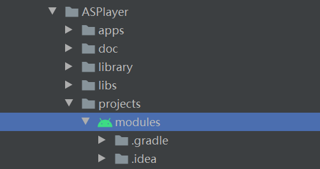

# ASPlayer

- [ASPlayer](#asplayer)
  - [ASPlayer简介](#asplayer简介)
  - [ASPlayer目录说明](#asplayer目录说明)
  - [ASPlayer编译](#asplayer编译)
    - [Android Studio编译](#android-studio编译)
      - [导入项目到Android Studio](#导入项目到android-studio)
      - [编译并运行 Demo](#编译并运行-demo)
      - [命令行编译 Demo](#命令行编译-demo)
      - [Android Studio下编译ASPlayer库](#android-studio下编译asplayer库)
      - [Android Studio下编译JNI-ASPlayer库](#android-studio下编译jni-asplayer库)
    - [AOSP源码环境编译](#aosp源码环境编译)


## ASPlayer简介

ASPlayer是一款支持播放TS流（暂时只支持TS流，后续也会支持ES流）的播放器，主要基于Android SDK的MediaCodec和AudioTrack实现音视频播放。
ASPlayer核心部分代码使用Java实现，同时，也提供了JNI接口用于C/CPP App通过JNI的方式调用ASPlayer实现播放。

## ASPlayer目录说明

ASPlayer包含四个模块：

| 模块 | 目录 | 作用 |
| :--- | :--- | :--- |
| ASPlayer-library | libs/ASPlayer-library | ASPlayer核心项目（目前用Java实现） |
| JNI-ASPlayer-library | libs/JNI-ASPlayer-library | JNI-ASPlayer，ASPlayer的JNI（C/CPP）接口 |
| JNI-ASPlayer-Wrap | library/JNI-ASPlayer-Wrap | Java调用JNI-ASPlayer的示例，把JNI-ASPlayer的接口封装为Java，方便Demo调用 |
| ASPlayerDemo | apps/ASPlayerDemo | 一个测试 ASPlayer的Demo |


## ASPlayer编译

### Android Studio编译

#### 导入项目到Android Studio

ASPlayer支持在Android Studio中进行编译，用 Android Studio 打开以下目录即可：
`<ASPLAYER_ROOT_PATH>/projects/modules/`

Android Studio中打开项目的示例步骤：
1. 依次点击菜单 “`File`” -> “`Open...`”
2. 导航到 `<ASPLAYER_ROOT_PATH>/projects` 目录，选择 `modules`，如下图：


#### 编译并运行 Demo

点击快捷菜单“`run`”即可：


#### 命令行编译 Demo

windows系统下使用下面的命令行编译Demo

进入（`cd`）到 `<ASPLAYER_ROOT_PATH>/projects/modules/`目录后，执行：

```
.\gradlew :ASPlayerDemo:clean
.\gradlew :ASPlayerDemo:build
```

编译出的apk在以下目录：

`apps/ASPlayerDemo/build/outputs/apk/debug/ASPlayerDemo-debug.apk`

#### Android Studio下编译ASPlayer库

使用以下命令编译 ASPlayer 库：

进入（`cd`）到 `<ASPLAYER_ROOT_PATH>/projects/modules/`目录后，执行：

```
.\gradlew :ASPlayer-library:clean
.\gradlew :ASPlayer-library:makeJar
```

编译出的jar包在以下目录：

`libs/ASPlayer-library/build/libs` 

#### Android Studio下编译JNI-ASPlayer库


### AOSP源码环境编译

`cd` 到指定模块后，执行 `mm -j8` 即可。

如，编译Demo：

```shell
$ cd <ASPLAYER_ROOT_PATH>/apps/ASPlayerDemo
$ mm -j8
```

